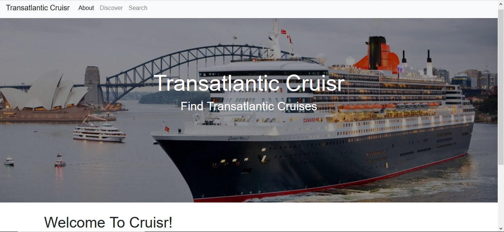
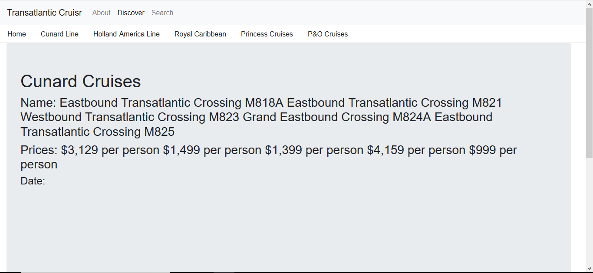

# Transatlantic-Cruisr

An app which allows a user to view and compare information on transatlantic cruises.

## How to Use

User opens application via the Heroku [link](https://transatlantic-cruisr.herokuapp.com) to the homepage and clicks "Discover" to go to the page featuring a series of tabs. There's a Home tab to explain the workings of the site, and the other apps open up to reveal the available cruise schedules and other information from five shipping companines which offer transatlantic service - Cunard, Holland-America, Royal Caribbean, Princess Cruises, and P&O.

### Prerequisites

npm [express](https://www.npmjs.com/package/express)

npm [bodyParser](https://www.npmjs.com/package/body-parser)

npm [mongoose](https://www.npmjs.com/package/mongoose)

npm [axios](https://www.npmjs.com/package/axios)

npm [cheerio](https://www.npmjs.com/package/cheerio)

npm [request](https://www.npmjs.com/package/request)

npm [express-handlebars](https://www.npmjs.com/package/express-handlebars)

yarn [yarn](https://yarnpkg.com/en/docs/usage)

### Technologies Used

Languages - HTML5, CSS4, JavaScript

Libraries - Bootstrap, jQuery

Database - MongoDB

Run-time system - Node.js

Framework - React

Other tools, technologies, and techniques - API routing, AJAX, web-scraping

Text Editor - Visual Studio Code

## Preview

### Home (Main) Page
- - - -

### Cruise Information
- - - -

## Contributing

Please feel free to branch off with tweaks and making a repo; open to suggestions!

## Future Development

* Getting the scraping, routes, and database perfected
* Organizing the data into useful information
* Ensuring that scrapped cruise information is not a duplicate of the ones already on the page.
* User validation
* Ability to save cruises
* More styling

## Authors

* **Wesley Hutchins** - [Github](https://github.com/WesPres1990) | [Portfolio](https://wespres1990.github.io/Basic-Portfolio/index.html)